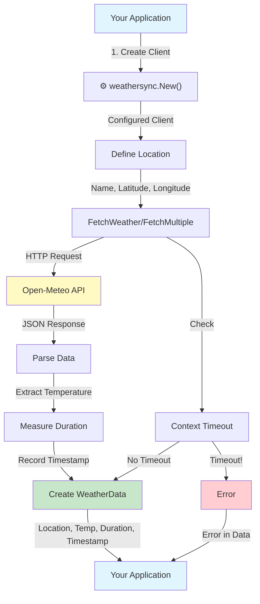
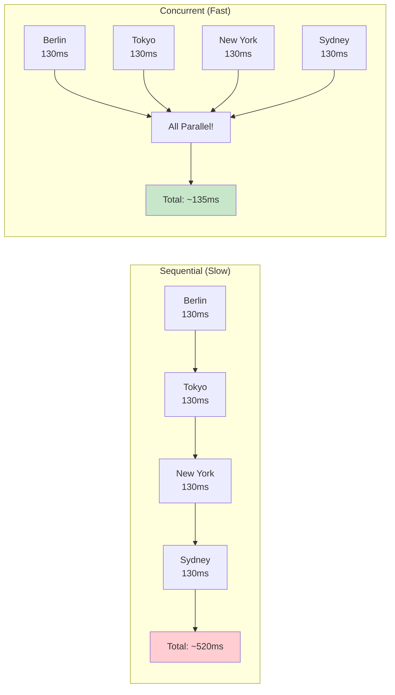

# WeatherSync Usage Guide

Complete guide on how to integrate and use the WeatherSync library in your Go applications.

---

## Table of Contents

1. [Installation](#installation)
2. [Quick Start](#quick-start)
3. [API Reference](#api-reference)
4. [Input/Output Data Flow](#inputoutput-data-flow)
5. [Usage Examples](#usage-examples)
6. [Error Handling](#error-handling)
7. [Best Practices](#best-practices)

---

## Installation

### Step 1: Add to your project

```bash
go get github.com/krupki/weathersync
```

### Step 2: Import in your code

```go
import "github.com/krupki/weathersync"
```

### Step 3: Create a client and start fetching

```go
client := weathersync.New()
```

---

## Quick Start

### Fetch weather for a single location

```go
package main

import (
    "context"
    "fmt"
    "log"
    
    "github.com/krupki/weathersync"
)

func main() {
    // 1. Create client
    client := weathersync.New()
    
    // 2. Define location (name + coordinates)
    location := weathersync.Location{
        Name:      "Berlin",
        Latitude:  52.52,
        Longitude: 13.41,
    }
    
    // 3. Fetch weather data
    data, err := client.FetchWeather(context.Background(), location)
    if err != nil {
        log.Fatal(err)
    }
    
    // 4. Use the data
    fmt.Printf("%s: %.1f°C\n", data.Location.Name, data.Temperature)
}
```

**Output:**

```text
Berlin: 15.3°C
```

---

## API Reference

### Types

#### `Location`

Input type representing a geographic location.

```go
type Location struct {
    Name      string  // Display name (e.g., "Berlin", "Tokyo")
    Latitude  float64 // Geographic latitude (-90 to 90)
    Longitude float64 // Geographic longitude (-180 to 180)
}
```

**Example:**

```go
berlin := weathersync.Location{
    Name:      "Berlin",
    Latitude:  52.52,
    Longitude: 13.41,
}
```

---

#### `WeatherData`

Output type containing weather information and metadata.

```go
type WeatherData struct {
    Location      Location      // The location this data belongs to
    Temperature   float64       // Temperature in Celsius
    FetchDuration time.Duration // How long the fetch took
    Timestamp     time.Time     // When this data was fetched
    Error         error         // Error if fetch failed (nil on success)
}
```

**Example response:**

```go
WeatherData{
    Location: Location{
        Name: "Berlin",
        Latitude: 52.52,
        Longitude: 13.41,
    },
    Temperature:   15.3,
    FetchDuration: 124 * time.Millisecond,
    Timestamp:     time.Now(),
    Error:         nil,
}
```

---

### Client Creation

#### `New(opts ...Option) *Client`

Creates a new WeatherSync client.

**Parameters:**

- `opts`: Optional configuration options

**Returns:**

- `*Client`: Configured client instance

**Example:**

```go
// Default client
client := weathersync.New()

// With custom timeout
client := weathersync.New(
    weathersync.WithTimeout(5 * time.Second),
)

// With custom HTTP client
customHTTP := &http.Client{
    Transport: myTransport,
}
client := weathersync.New(
    weathersync.WithHTTPClient(customHTTP),
)
```

---

### Configuration Options

#### `WithTimeout(d time.Duration) Option`

Sets HTTP request timeout.

**Default:** 10 seconds

```go
client := weathersync.New(
    weathersync.WithTimeout(3 * time.Second),
)
```

---

#### `WithHTTPClient(client *http.Client) Option`

Uses a custom HTTP client.

```go
customClient := &http.Client{
    Transport: &http.Transport{
        MaxIdleConns: 100,
    },
}

client := weathersync.New(
    weathersync.WithHTTPClient(customClient),
)
```

---

#### `WithAPIURL(url string) Option`

Sets a custom weather API URL.

**Default:** `https://api.open-meteo.com`

```go
client := weathersync.New(
    weathersync.WithAPIURL("https://my-weather-proxy.com"),
)
```

---

### Methods

#### `FetchWeather(ctx context.Context, location Location) (*WeatherData, error)`

Fetches weather data for a single location.

**Parameters:**

- `ctx`: Context for timeout/cancellation
- `location`: Location to fetch weather for

**Returns:**

- `*WeatherData`: Weather data with temperature
- `error`: Error if request fails

**Example:**

```go
ctx := context.Background()
data, err := client.FetchWeather(ctx, location)
if err != nil {
    log.Fatal(err)
}
fmt.Printf("Temperature: %.1f°C\n", data.Temperature)
```

---

#### `FetchMultiple(ctx context.Context, locations []Location) []WeatherData`

Fetches weather data for multiple locations **concurrently**.

**Parameters:**

- `ctx`: Context for timeout/cancellation
- `locations`: Slice of locations to fetch

**Returns:**

- `[]WeatherData`: Slice with results (check `.Error` field for failures)

**Example:**

```go
locations := []weathersync.Location{
    {Name: "Berlin", Latitude: 52.52, Longitude: 13.41},
    {Name: "Tokyo", Latitude: 35.68, Longitude: 139.75},
}

results := client.FetchMultiple(context.Background(), locations)

for _, data := range results {
    if data.Error != nil {
        fmt.Printf("%s: Error - %v\n", data.Location.Name, data.Error)
    } else {
        fmt.Printf("%s: %.1f°C\n", data.Location.Name, data.Temperature)
    }
}
```

---

## Input/Output Data Flow

### Visual Flow Diagram



---

### Detailed Data Flow

#### Input: What you provide

```go
// You create a Location with:
location := weathersync.Location{
    Name:      "Berlin",        // String: City name for display
    Latitude:  52.52,           // float64: -90 to 90
    Longitude: 13.41,           // float64: -180 to 180
}
```

#### Processing: What happens inside

1. **HTTP Request:** Library calls Open-Meteo API with your coordinates
2. **JSON Parsing:** Response is parsed into internal structure
3. **Data Extraction:** Temperature is extracted from `current.temperature_2m`
4. **Metadata Collection:** Fetch duration and timestamp are recorded
5. **Error Handling:** Any errors are captured in the result

#### Output: What you get back

```go
// You receive WeatherData with:
data := &weathersync.WeatherData{
    Location: weathersync.Location{    // Your original location
        Name:      "Berlin",
        Latitude:  52.52,
        Longitude: 13.41,
    },
    Temperature:   15.3,               // float64: Temperature in Celsius
    FetchDuration: 124ms,              // time.Duration: How long it took
    Timestamp:     time.Now(),         // time.Time: When fetched
    Error:         nil,                // error: nil if success, error if failed
}
```

### Concurrent vs Sequential Processing



---

## Usage Examples

### Example 1: Basic Single Fetch

```go
func main() {
    client := weathersync.New()
    
    location := weathersync.Location{
        Name:      "Paris",
        Latitude:  48.85,
        Longitude: 2.35,
    }
    
    data, err := client.FetchWeather(context.Background(), location)
    if err != nil {
        log.Fatalf("Failed: %v", err)
    }
    
    fmt.Printf(" %s: %.1f°C (fetched in %v)\n", 
        data.Location.Name, 
        data.Temperature,
        data.FetchDuration,
    )
}
```

**Output:**

```text
Paris: 18.5°C (fetched in 135ms)
```

---

### Example 2: Multiple Locations (Parallel)

```go
func main() {
    client := weathersync.New()
    
    locations := []weathersync.Location{
        {Name: "Berlin", Latitude: 52.52, Longitude: 13.41},
        {Name: "Tokyo", Latitude: 35.68, Longitude: 139.75},
        {Name: "New York", Latitude: 40.71, Longitude: -74.01},
    }
    
    // All fetched concurrently!
    results := client.FetchMultiple(context.Background(), locations)
    
    for _, data := range results {
        if data.Error != nil {
            fmt.Printf("%s: %v\n", data.Location.Name, data.Error)
            continue
        }
        fmt.Printf("%s: %.1f°C\n", data.Location.Name, data.Temperature)
    }
}
```

**Output:**

```text
Berlin: 15.3°C
Tokyo: 22.1°C
New York: 18.7°C
```

---

### Example 3: With Timeout

```go
func main() {
    client := weathersync.New(
        weathersync.WithTimeout(2 * time.Second),
    )
    
    // Create context with timeout
    ctx, cancel := context.WithTimeout(context.Background(), 1*time.Second)
    defer cancel()
    
    location := weathersync.Location{
        Name: "Sydney", Latitude: -33.87, Longitude: 151.21,
    }
    
    data, err := client.FetchWeather(ctx, location)
    if err != nil {
        if errors.Is(err, context.DeadlineExceeded) {
            log.Println("Request timed out")
        }
        log.Fatal(err)
    }
    
    fmt.Printf("%s: %.1f°C\n", data.Location.Name, data.Temperature)
}
```

---

### Example 4: Building a Dashboard

```go
func main() {
    client := weathersync.New()
    
    // Define your cities
    cities := []weathersync.Location{
        {Name: "London", Latitude: 51.51, Longitude: -0.13},
        {Name: "Paris", Latitude: 48.85, Longitude: 2.35},
        {Name: "Berlin", Latitude: 52.52, Longitude: 13.41},
    }
    
    // Fetch all at once
    results := client.FetchMultiple(context.Background(), cities)
    
    // Display in table format
    fmt.Println("European Cities Weather Dashboard")
    fmt.Println("==================================")
    for _, data := range results {
        if data.Error == nil {
            fmt.Printf("%-15s %6.1f°C\n", data.Location.Name, data.Temperature)
        }
    }
}
```

**Output:**

```text
European Cities Weather Dashboard
==================================
London          14.2°C
Paris           18.5°C
Berlin          15.3°C
```

---

## Error Handling

### Check for errors in single fetches

```go
data, err := client.FetchWeather(ctx, location)
if err != nil {
    log.Printf("Failed to fetch weather: %v", err)
    return
}
// Use data safely
```

### Check for errors in multiple fetches

```go
results := client.FetchMultiple(ctx, locations)

for _, data := range results {
    if data.Error != nil {
        // This specific location failed
        log.Printf("%s failed: %v", data.Location.Name, data.Error)
        continue
    }
    // Process successful result
    fmt.Printf("%s: %.1f°C\n", data.Location.Name, data.Temperature)
}
```

### Common Error Types

| Error Type | Cause | Solution |
| ------------ | ------- | ---------- |
| `context.DeadlineExceeded` | Request timeout | Increase timeout or check network |
| `http: StatusCode != 200` | API error | Check coordinates, API availability |
| `json: cannot unmarshal` | Invalid response | Contact library maintainer |
| `net/http: request canceled` | Context cancelled | Check context lifetime |

---

## Best Practices

### DO

1. **Reuse the client**

   ```go
   client := weathersync.New()
   // Use client multiple times
   data1, _ := client.FetchWeather(ctx, loc1)
   data2, _ := client.FetchWeather(ctx, loc2)
   ```

2. **Use context for control**

   ```go
   ctx, cancel := context.WithTimeout(context.Background(), 5*time.Second)
   defer cancel()
   data, err := client.FetchWeather(ctx, location)
   ```

3. **Check errors properly**

   ```go
   if data.Error != nil {
       log.Printf("Error: %v", data.Error)
   }
   ```

4. **Use FetchMultiple for multiple locations**

   ```go
   // Parallel - Fast!
   results := client.FetchMultiple(ctx, locations)
   ```

### DON'T

1. **Don't create new clients repeatedly**

   ```go
   // BAD: Creates new HTTP client each time
   for _, loc := range locations {
       client := weathersync.New()
       client.FetchWeather(ctx, loc)
   }
   ```

2. **Don't fetch sequentially if you need multiple**

   ```go
   // SLOW: Sequential requests
   for _, loc := range locations {
       client.FetchWeather(ctx, loc)  // Each waits for previous
   }
   
   // FAST: Use FetchMultiple instead!
   client.FetchMultiple(ctx, locations)
   ```

3. **Don't ignore errors**

   ```go
   // BAD
   data, _ := client.FetchWeather(ctx, location)
   fmt.Println(data.Temperature)  // Might be zero if error!
   ```

---

## Integration Examples

### Web API Handler (HTTP Server)

```go
func weatherHandler(w http.ResponseWriter, r *http.Request) {
    client := weathersync.New()
    
    location := weathersync.Location{
        Name:      r.URL.Query().Get("city"),
        Latitude:  parseFloat(r.URL.Query().Get("lat")),
        Longitude: parseFloat(r.URL.Query().Get("lon")),
    }
    
    data, err := client.FetchWeather(r.Context(), location)
    if err != nil {
        http.Error(w, err.Error(), http.StatusInternalServerError)
        return
    }
    
    json.NewEncoder(w).Encode(data)
}
```

### CLI Tool

```go
func main() {
    city := flag.String("city", "", "City name")
    lat := flag.Float64("lat", 0, "Latitude")
    lon := flag.Float64("lon", 0, "Longitude")
    flag.Parse()
    
    client := weathersync.New()
    location := weathersync.Location{
        Name:      *city,
        Latitude:  *lat,
        Longitude: *lon,
    }
    
    data, err := client.FetchWeather(context.Background(), location)
    if err != nil {
        log.Fatal(err)
    }
    
    fmt.Printf("%s: %.1f°C\n", data.Location.Name, data.Temperature)
}
```

---

## Performance Tips

1. **Batch requests with FetchMultiple**
   - 10 locations in ~120ms vs ~1200ms sequential

2. **Reuse HTTP client**
   - Create client once, reuse many times

3. **Use appropriate timeouts**
   - Default 10s is good for most cases
   - Reduce for low-latency requirements

4. **Consider caching**
   - Weather doesn't change every second
   - Cache results for 5-10 minutes

---

## Need Help?

- Check [README.md](README.md) for overview
- See [examples/](examples/) for working code
- Read [CONTRIBUTING.md](CONTRIBUTING.md) to contribute
- Open an issue on GitHub

---

**Happy coding!**
